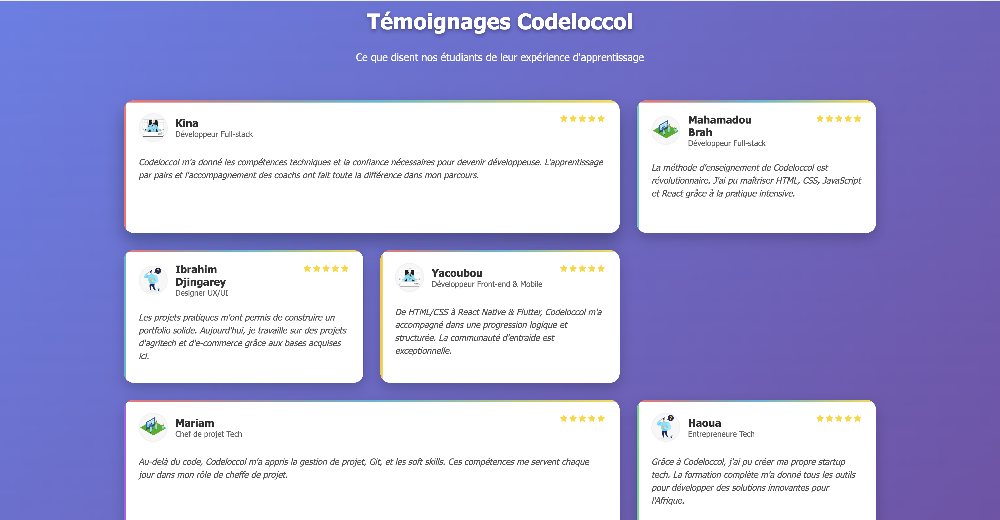
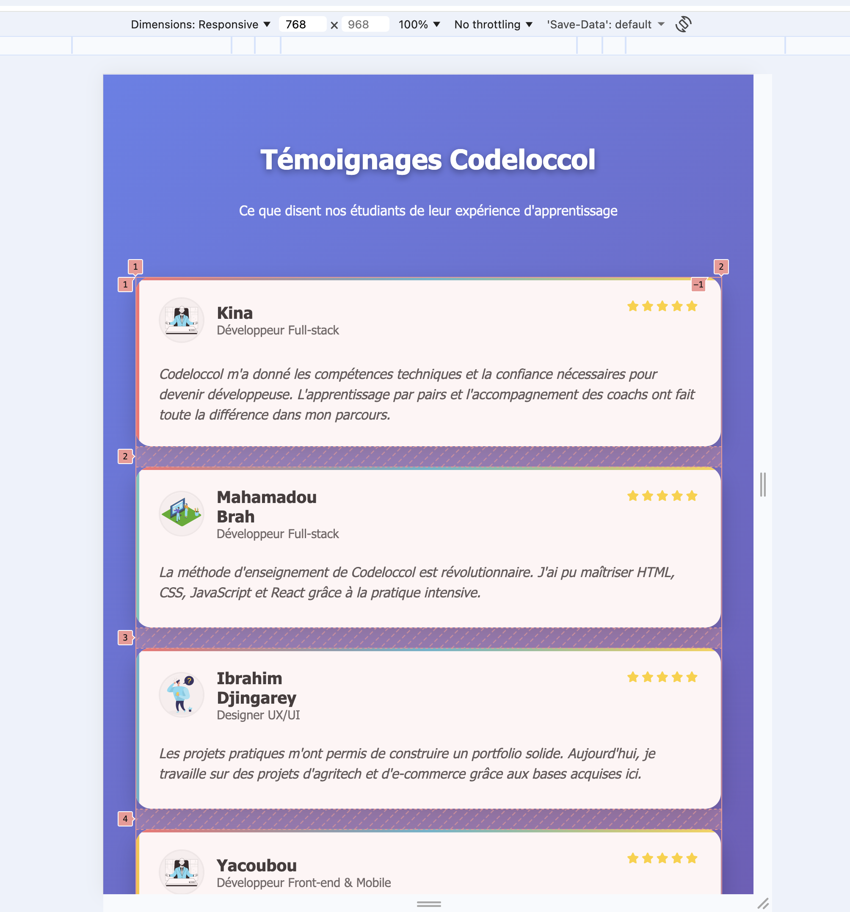
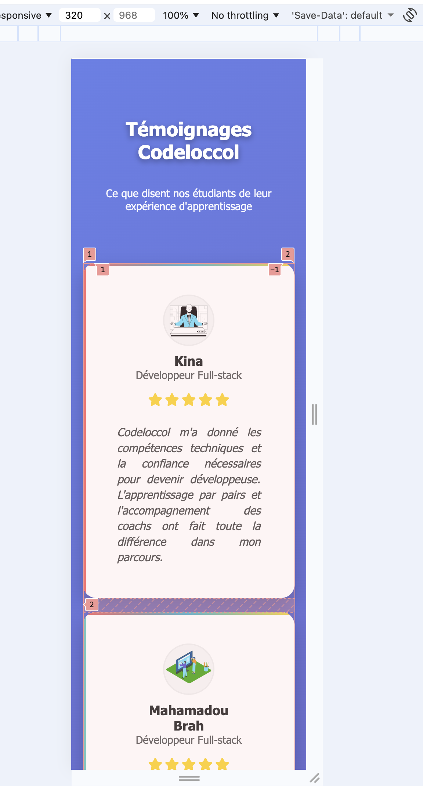

#  Témoignages Codeloccol

Une page web moderne et responsive présentant les témoignages des étudiants de **Codeloccol**.  
Ce projet met en pratique les fondamentaux du **HTML**, du **CSS** et de la **mise en page responsive** via **CSS Grid**.

---

##  Objectif du projet

Ce projet a pour but de :
- Structurer le contenu avec des **balises sémantiques HTML5**.
- Mettre en page une **grille de témoignages responsive**.
- Utiliser **CSS Grid** et les **media queries** pour s’adapter à tous les écrans.
- Valoriser les retours d’expérience des apprenants à travers une interface élégante et fluide.

---

## Technologies utilisées

- **HTML5** : structure sémantique du contenu.  
- **CSS3** : mise en forme, animations et responsive design.  
- **CSS Grid** : disposition adaptative des cartes de témoignages.  
- **Font Awesome** : icônes d’étoiles pour la notation.  
- **Google Fonts (Segoe UI)** : typographie lisible et moderne.  

---

##  Fonctionnalités clés

- Responsive design complet (mobile, tablette, desktop).  
- Animations **fade-in** progressives à l’apparition.  
- Bordures décoratives en **dégradé de couleurs**.  
- Ombres douces et effets de survol.  
- Structure claire et réutilisable pour tout projet similaire.

---

### Liens du projet

- Lien du dépôt GitHub :

- Lien de la page déployée :

### Auteur

Nom : Abdallah Alher
Formation : Codeloccol
Projet : Témoignages Page — Front-End HTML & CSS
Année : 2025

### Captures :

